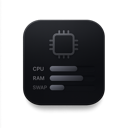

# Stats

Aplicativo nativo para macOS que exibe uso de CPU, memória RAM e swap diretamente na barra de menu. A proposta do projeto é ser simples de abrir, leve em execução e fácil de manter, sem dependências externas e sem interface desnecessária.



## Visão geral

O Stats foi pensado como um utilitário de leitura rápida: ele mostra as métricas essenciais do sistema sem abrir janela e sem disputar atenção com o restante do ambiente. O foco aqui é clareza de implementação, baixo acoplamento e uso direto das APIs nativas do macOS.

## Funcionalidades

- Exibe CPU, RAM e swap em tempo real na barra de menu.
- Atualiza as métricas em background em intervalos regulares.
- Permite ativar a abertura automática no login.
- Usa apenas APIs nativas do macOS.
- Não depende de bibliotecas de terceiros.

## Decisões técnicas

- `SwiftUI` entra apenas como ponto de inicialização do app.
- `AppKit` controla o `NSStatusItem`, o menu contextual e a interação com a barra de menu.
- `Darwin / Mach APIs` fazem a coleta de CPU e memória com baixo nível de abstração.
- `ServiceManagement` é usado para a opção de abrir junto com o sistema.
- `DispatchSourceTimer` mantém a coleta fora da thread principal.

## Estrutura do projeto

- `Stats/App`: ponto de entrada e coordenação do item da barra de menu.
- `Stats/Services`: leitura de CPU, memória e swap usando APIs do sistema.
- `Stats/Assets.xcassets`: ícones do aplicativo.
- `Stats.xcodeproj`: configuração do projeto Xcode.

## Requisitos

- macOS 14.0 ou superior
- Xcode 15 ou superior

## Como executar

### Pelo Xcode

1. Clone este repositório.
2. Abra `Stats.xcodeproj`.
3. Execute com `Cmd + R`.

### Pelo terminal

```bash
xcodebuild -project Stats.xcodeproj -scheme Stats build
open "$(xcodebuild -project Stats.xcodeproj -scheme Stats -showBuildSettings 2>/dev/null | grep -m1 BUILT_PRODUCTS_DIR | awk '{print $3}')/Stats.app"
```

## Como usar

- Ao iniciar, o app aparece na barra de menu com as métricas atuais.
- Clique no item para abrir o menu.
- Use `Open at Login` para alternar a inicialização automática.
- Use `Quit Stats` para encerrar o processo.

## O que este projeto demonstra

- Organização simples e direta para um utilitário de desktop.
- Integração com APIs nativas do macOS.
- Separação clara entre a camada de interface e a coleta de métricas.
- Preocupação com baixo overhead e manutenção fácil.

## Validação realizada

- Build completo com `xcodebuild -project Stats.xcodeproj -scheme Stats build`
- Revisão manual de estrutura, legibilidade e arquivos versionados

## Próximos passos

- Adicionar testes para a lógica de formatação e leitura de métricas.
- Evoluir o menu com mais opções de configuração.
- Incluir uma captura real do app em uso no `README`.
